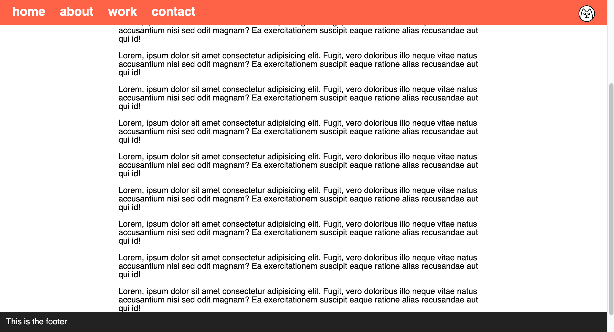

# Navigation and Footer

### Aufgaben: 
Erstelle eine Website, die so aussieht wie auf den Bildern unten

1. Die Seite muss genug Inhalt (Text) haben, damit eine Scroll-leiste erscheint.
2. Füge eine Navigations-Leiste (navbar) ein
3. Füge das Icon mit der Katze rechts in der Navigationsleiste ein.
4. Füge ein Footer ein
5. Navbar und Footer sollten immer sichtbar sein. 

